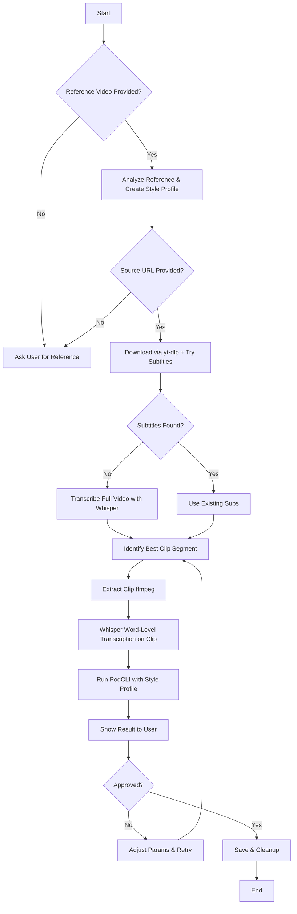

# AI Workflow: Reference-Guided Podcast Clipping

This workflow guides AI agents through a step-by-step process to create podcast shorts based on a reference video style. Follow these steps strictly when the user provides a reference video and a source video URL.

## Prerequisites
- `podcli` installed and configured
- `yt-dlp` installed
- Access to Whisper AI (local or API)
- User has provided:
  1. A **reference video** (style guide)
  2. A **source video URL** (YouTube link to process)

---

## Step 1: Analyze Reference Video

**Goal:** Understand the style, pacing, caption format, and visual preferences from the reference.

**Actions:**
1. Ask the user to provide the reference video file or path.
2. If the reference is a URL, download it using:
   ```bash
   yt-dlp -f "best[height<=1080]" -o "reference_video.mp4" "<REFERENCE_URL>"
   ```
3. Analyze the reference video for:
   - **Aspect Ratio:** (9:16, 16:9, or 1:1)
   - **Caption Style:** (Bold, Minimal, Karaoke, or Custom)
   - **Clip Duration:** Average length of clips (e.g., 30s, 60s)
   - **Visual Focus:** Face-tracking, static, or dynamic zoom
   - **Tone/Pacing:** Fast cuts, slow burns, humorous, serious
4. Save these observations in a temporary config file (e.g., `style_profile.json`).

**Output:** A clear style profile to guide the clipping process.

---

## Step 2: Download Source Video

**Goal:** Retrieve the source content locally.

**Actions:**
1. Receive the YouTube URL from the user.
2. Download the video using `yt-dlp`:
   ```bash
   yt-dlp -f "best[height<=1080]" --write-sub --sub-lang en -o "source_video.mp4" "<YOUTUBE_URL>"
   ```
   - Try to download existing subtitles/captions first (`--write-sub`).
   - If successful, save the `.vtt` or `.srt` file as `source_subs_initial`.

**Output:** `source_video.mp4` and optionally `source_subs_initial.vtt`.

---

## Step 3: Attempt Initial Transcription

**Goal:** Get a base transcription to identify potential clip segments.

**Logic:**
- **IF** `yt-dlp` successfully downloaded subtitles in Step 2:
  - Use these as the initial transcription.
  - Proceed to **Step 4**.
- **ELSE** (no subtitles available):
  - Run Whisper AI on the full video to generate a transcript:
    ```bash
    whisper source_video.mp4 --model medium --output_format vtt --output_dir ./
    ```
  - Save as `source_subs_whisper_initial.vtt`.
  - Proceed to **Step 4**.

---

## Step 4: Identify and Extract Clip Segment

**Goal:** Cut the most relevant segment based on the reference style and transcript content.

**Actions:**
1. Compare the source transcript with the **style profile** from Step 1.
2. Identify the best timestamp range (`START_TIME` to `END_TIME`) that matches:
   - High engagement potential (based on reference tone).
   - Coherent thought/sentence structure.
   - Desired duration (e.g., 45 seconds).
3. Extract the clip using `ffmpeg`:
   ```bash
   ffmpeg -i source_video.mp4 -ss <START_TIME> -to <END_TIME> -c copy temp_clip.mp4
   ```

**Output:** `temp_clip.mp4` (the raw cut segment).

---

## Step 5: High-Precision Transcription (Word-Level)

**Goal:** Ensure perfect caption timing and accuracy for the specific clip.

**Actions:**
1. Run Whisper AI on the **extracted clip** (`temp_clip.mp4`) with word-level timestamps:
   ```bash
   whisper temp_clip.mp4 --model large-v3 --word_timestamps True --output_format vtt --output_dir ./
   ```
2. Save the output as `clip_precise_subs.vtt`.
   - *Note:* Using `large-v3` and `--word_timestamps` ensures captions sync perfectly with spoken words for professional results.

**Output:** `clip_precise_subs.vtt` (high-accuracy subtitles).

---

## Step 6: Generate Final Short with PodCLI

**Goal:** Render the final vertical short with captions and styling.

**Actions:**
1. Prepare the PodCLI command using the style profile from Step 1 and the precise subs from Step 5.
2. Run `podcli` to create the short:
   ```bash
   podcli make \
     --input temp_clip.mp4 \
     --subs clip_precise_subs.vtt \
     --aspect 9:16 \
     --caption-style <STYLE_FROM_PROFILE> \
     --face-track \
     --output final_short.mp4
   ```
   - Adjust flags (`--aspect`, `--caption-style`, `--face-track`) based on the **style profile**.

**Output:** `final_short.mp4`.

---

## Step 7: Review and Iterate

**Goal:** User validation and refinement.

**Actions:**
1. Display `final_short.mp4` to the user.
2. Ask for feedback:
   - "Does this match the reference style?"
   - "Are the captions accurate?"
   - "Is the clip duration correct?"
3. **If improvements are needed:**
   - Adjust timestamps, caption style, or clip selection based on feedback.
   - Return to **Step 4** or **Step 6** as necessary.
4. **If approved:**
   - Save the final file to the user's designated output folder.
   - Clean up temporary files (`temp_clip.mp4`, intermediate subs).

---

## Summary Flowchart




## Notes for AI Agents
- **Always prioritize the reference style.** The goal is to mimic the user's desired aesthetic, not just process video.
- **Word-level transcription is critical.** Do not skip Step 5; generic subs often lead to misaligned captions.
- **Be iterative.** The first clip might not be perfect. Encourage user feedback loops.
- **Resource Management:** Whisper `large-v3` is heavy. If resources are low, fallback to `medium` but warn the user about potential accuracy loss.
- ***Recommended is using base/medium model on the 2 T4 GPUs to do it fast***
- ****If whisper is giving bugs install whisper separetly****
- If you want to skip the mcp part you can but then you need to use podcli commands for work.
